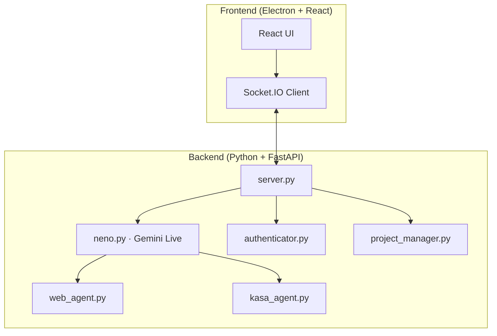

# N.E.N.O V2


> **N.E.N.O** — asistente multimodal por voz: visión opcional, automatización web, hogar inteligente y proyectos locales.

N.E.N.O V2 combina **Gemini Live** (audio nativo en tiempo real) con una interfaz **Electron + React** y un backend **Python (FastAPI + Socket.IO)**. Puedes hablar con el asistente, enviar vídeo de la webcam al modelo, delegar tareas al navegador (Playwright), controlar luces TP-Link Kasa y organizar el trabajo en carpetas de proyecto.

Esto es una evolución un poco diferentes de la 

---

## Capacidades

| Función | Descripción | Tecnología |
|---------|-------------|------------|
| **Voz en tiempo real** | Conversación con baja latencia e interrupciones | Gemini 2.5 Native Audio |
| **Visión (opcional)** | Frames de webcam al modelo cuando el vídeo está activo | `getUserMedia` + Socket.IO |
| **Autenticación facial** | Bloqueo local opcional antes de usar la IA | MediaPipe Face Landmarker |
| **Agente web** | Automatización del navegador por voz o herramientas | Playwright + Chromium |
| **Hogar inteligente** | Luces/enchufes TP-Link Kasa | `python-kasa` |
| **Proyectos y memoria** | Contexto persistente, historial y archivos por proyecto | `project_manager.py` |
| **Archivos y documentos** | Leer/escribir en el proyecto; abrir con apps del sistema | Herramientas Gemini + `open_document` |
| **Avatar central** | Imágenes en el círculo central que rotan y pulsan con la voz del modelo | Carpeta `img/` + visualizador |

> **Nota:** La generación CAD 3D y el control por gestos de mano **no forman parte** de esta versión.

### Avatar central (`img/`)

Coloca imágenes en la carpeta **`img/`** en la raíz del proyecto (p. ej. `01.png`, `02.png`, `03.webp`). El visualizador central las muestra en lugar del texto «N.E.N.O»:

- **Reposo:** primera imagen (orden alfabético/natural) y anillo en modo «respiración».
- **Cuando la IA habla:** las imágenes van alternándose (~420 ms) y la escala sigue la amplitud del audio del modelo.
- Formatos admitidos: `.png`, `.jpg`, `.jpeg`, `.webp`, `.gif`.
- Si `img/` está vacía, la interfaz indica que debes añadir archivos ahí.

---

## Arquitectura



---

## Inicio rápido

### Requisitos

- **Python 3.10–3.11** (recomendado 3.11)
- **Node.js 18+**
- Micrófono; webcam si usas vídeo o face auth
- Clave API de [Google AI Studio](https://aistudio.google.com/app/apikey)

### Linux (ejemplo)

```bash
cd /ruta/a/NENO

python3 -m venv venv
source venv/bin/activate
pip install -r requirements.txt
playwright install chromium

npm install

# En la raíz del repo (no dentro de backend/)
echo "GEMINI_API_KEY=tu_clave_aqui" > .env

npm run dev
```

El script `npm run dev` arranca Vite + Electron y el backend Python en segundo plano.

### Solo backend (depuración)

```bash
source venv/bin/activate
python backend/server.py
```

En otra terminal: `npm run dev` (o solo Vite si no necesitas Electron).

### Variables útiles

| Variable | Uso |
|----------|-----|
| `GEMINI_API_KEY` | Obligatoria en `.env` en la raíz |
| `NENO_BIND_HOST=0.0.0.0` | Exponer el backend en la LAN (móvil en la misma Wi‑Fi) |
| `VITE_SOCKET_URL` | URL fija del Socket.IO en el cliente |
| `VITE_SOCKET_SAME_ORIGIN=true` | Socket en el mismo origen (p. ej. detrás de Apache) |

Más detalle en [AGENTS.md](AGENTS.md) (red local, Apache, HTTPS en móvil).

---

## Autenticación facial (opcional)

1. Foto clara del rostro → `backend/reference.jpg`
2. En Ajustes o `settings.json`: `"face_auth_enabled": true`

Los datos faciales se procesan **en local**; no se suben a la nube.

---

## Configuración (`settings.json`)

Se crea/actualiza en la raíz o en `backend/settings.json` según el despliegue. Claves habituales:

| Clave | Tipo | Descripción |
|-------|------|-------------|
| `face_auth_enabled` | `bool` | Bloquea la UI hasta reconocer el rostro |
| `tool_permissions` | `obj` | Confirmación manual por herramienta |
| `tool_permissions.run_web_agent` | `bool` | Confirmar antes de abrir el agente web |
| `tool_permissions.write_file` | `bool` | Confirmar antes de escribir archivos |
| `voice_name` | `string` | Voz Gemini Live (p. ej. `Charon`) |
| `response_language` | `string` | Idioma de respuesta (`es_es`, `en`, …) |
| `theme` | `string` | Tema visual del frontend |

---

## Primer uso (checklist)

1. **Voz:** Conectar (botón de encendido) y decir «Hola N.E.N.O».
2. **Cara:** Si face auth está activo, mirar a la cámara hasta desbloquear.
3. **Vídeo:** Activar cámara en la barra de herramientas si quieres que el modelo vea.
4. **Web:** Abrir ventana del navegador y pedir una tarea («abre Google», etc.).
5. **Kasa:** Icono de bombilla → descubrir dispositivos en la misma red.

---

## Comandos de ejemplo

- «Cambia al proyecto [nombre]» / «Crea un proyecto llamado [nombre]»
- «Enciende la luz del salón» / «Pon la luz en azul»
- «Abre el archivo informe.pdf» (según permisos de `open_document`)
- «Ve a [sitio web] y busca…» (agente web)

---

## Estructura del proyecto

```
NENO/
├── backend/
│   ├── neno.py              # Gemini Live, audio, herramientas
│   ├── server.py            # FastAPI + Socket.IO
│   ├── web_agent.py         # Playwright
│   ├── kasa_agent.py        # TP-Link Kasa
│   ├── authenticator.py     # Face auth (MediaPipe)
│   ├── project_manager.py   # Proyectos y contexto
│   ├── tools.py             # Declaraciones de herramientas
│   ├── capture_face.py      # Utilidad para capturar reference.jpg
│   └── reference.jpg        # (opcional) tu foto para face auth
├── img/                     # Frames del avatar central (png, jpg, webp, …)
├── src/
│   ├── App.jsx
│   ├── avatarFrames.js      # Carga ordenada de img/
│   └── components/          # UI (chat, ajustes, Kasa, navegador, …)
├── electron/
│   └── main.js
├── tests/                   # pytest
├── projects/                # Datos de usuario (gitignored)
├── .env                     # GEMINI_API_KEY (no commitear)
├── requirements.txt
├── package.json
└── README.md
```

---

## Pruebas

```bash
source venv/bin/activate
pytest
# o un módulo:
python tests/test_runner.py --module=tools
```

---

## Solución de problemas

### Electron: `chrome-sandbox` / `setuid_sandbox_host` (Linux)

En Linux, si al ejecutar `npm run dev` aparece un error sobre `chrome-sandbox` y modo `4755`, el sandbox SUID de Chromium no está configurado (habitual en `/var/www`, servidores o sin root).

La app ya arranca con `--no-sandbox` en Linux por defecto. Si quieres usar el sandbox nativo:

```bash
sudo chown root:root node_modules/electron/dist/chrome-sandbox
sudo chmod 4755 node_modules/electron/dist/chrome-sandbox
NENO_ELECTRON_SANDBOX=1 npm run dev
```

**Solo frontend en el navegador** (sin Electron): en otra terminal, `source venv/bin/activate && python backend/server.py`, y abre `http://localhost:5173`.

### Cámara / permisos (macOS)

**Sistema → Privacidad → Cámara** → permitir Terminal, VS Code o Electron.

### `GEMINI_API_KEY` no encontrada

- Archivo `.env` en la **raíz** del repo.
- Formato: `GEMINI_API_KEY=clave` (sin comillas).

### El móvil no conecta al backend

- Arrancar con `NENO_BIND_HOST=0.0.0.0`.
- Abrir puertos **5173** (Vite) y **8000** (backend) en el firewall.
- En HTTP + IP, mic/cámara pueden fallar; usar HTTPS o `localhost` en escritorio.

### Error WebSocket 1011 (Gemini)

Error transitorio del servicio; reconectar o reintentar.

---

## Limitaciones conocidas

| Tema | Detalle |
|------|---------|
| **Plataformas** | Probado en macOS y Windows; Linux variable |
| **Cámara** | Necesaria para face auth y para enviar vídeo al modelo |
| **Red** | Gemini requiere internet |
| **Cuota API** | Límites del plan gratuito de Google |
| **Un usuario** | Face auth con una sola `reference.jpg` |

---

## Seguridad

- No commitear `.env` ni `reference.jpg`.
- Las confirmaciones de herramientas evitan escritura/web no deseadas.
- Los proyectos viven en `projects/` en disco local.

---

## Contribuir

1. Fork → rama → cambios → PR con descripción clara.
2. Ejecutar `pytest` y `npm run build` antes de enviar.

---

## Agradecimientos

- [Google Gemini](https://deepmind.google/technologies/gemini/) — Live / Native Audio
- [MediaPipe](https://developers.google.com/mediapipe) — autenticación facial
- [Playwright](https://playwright.dev/) — automatización web
- [python-kasa](https://github.com/GadgetReactor/python-kasa) — dispositivos Kasa

---

## Licencia

**MIT** — ver [LICENSE](LICENSE).

---

<p align="center">
  <strong>N.E.N.O V2</strong><br>
  <em>Voz, visión y automatización en una sola interfaz</em>
</p>
